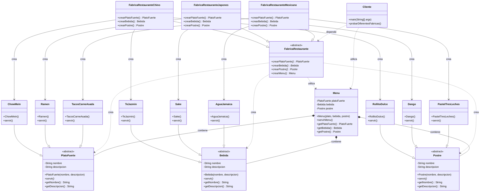

# Diagrama UML - Patrón Abstract Factory para Restaurantes

## Estructura del Patrón

## Explicación del Diagrama

### Componentes del Patrón

1. **Productos Abstractos** (`PlatoFuerte`, `Bebida`, `Postre`)
   - Definen la interfaz común para todos los productos de cada tipo
   - No contienen implementación específica

2. **Productos Concretos**
   - Implementaciones específicas para cada cocina
   - Ej: `ChowMein`, `Ramen`, `TacosCarneAsada` heredan de `PlatoFuerte`

3. **Fábrica Abstracta** (`FabricaRestaurante`)
   - Define métodos para crear cada tipo de producto
   - No especifica qué productos concretos crear

4. **Fábricas Concretas**
   - Implementan los métodos de la fábrica abstracta
   - Cada fábrica crea productos de una sola cocina
   - Ej: `FabricaRestauranteChino` solo crea productos chinos

5. **Cliente** (`Cliente`)
   - Trabaja con interfaces abstractas
   - No conoce los detalles de las implementaciones concretas

### Flujo del Patrón

1. El cliente solicita una fábrica específica
2. La fábrica crea productos compatibles entre sí
3. El cliente recibe y utiliza los productos sin conocer su tipo concreto

### Ventajas del Diseño

- **Encapsulación**: El cliente no necesita conocer las clases concretas
- **Consistencia**: Los productos creados por una fábrica son compatibles
- **Extensibilidad**: Fácil agregar nuevas cocinas sin modificar el cliente
- **Desacoplamiento**: Reducción de dependencias entre componentes
